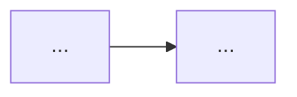

# Reader Agent

AI-powered reading assistant for academic papers, reports, and ebooks. Upload a PDF or EPUB, get structured reading notes with concept maps and citation graphs.

## Features

- **Single-Agent + Skills Architecture** — One ReAct agent with modular tools (parse, summarize, extract concepts, save notes)
- **PDF & EPUB Support** — Parses structured sections from both formats
- **Structured Notes** — One-sentence summary, chapter highlights, terminology glossary, critical thinking, original quotes
- **Concept Relationship Maps** — Mermaid flowcharts showing causal chains between key concepts
- **Citation Graphs** — Extracted references with author/year/title/venue
- **Reading Mode UI** — Dark-themed Streamlit reader with adjustable font size, line height, and content width
- **Batch Processing** — Process entire folders of documents

## Tech Stack

| Layer | Tool |
|-------|------|
| Multi-Agent Framework | LangGraph (ReAct) |
| LLM | DeepSeek (OpenAI-compatible API) |
| PDF Parsing | PyMuPDF |
| EPUB Parsing | Standard library (zipfile + xml.etree) |
| UI | Streamlit |
| Dependency Management | Poetry |

## Quick Start

### 1. Clone & Setup

```bash
git clone <repo-url>
cd reader-agent
cp .env.example .env
# Edit .env with your DeepSeek API key
```

### 2. Install Dependencies

```bash
# Using Poetry
poetry install

# Or using pip
python3 -m venv .venv
source .venv/bin/activate
pip install langgraph langchain-openai pymupdf python-dotenv streamlit markdown
```

### 3. Run

**CLI mode:**
```bash
# Single file
PYTHONPATH=src python3 -m reader_agent ~/Downloads/paper.pdf

# Batch folder
PYTHONPATH=src python3 -m reader_agent ~/Documents/ebooks/
```

**Streamlit UI:**
```bash
streamlit run app.py
# Open http://localhost:8501
```

## Environment Variables

```bash
DEEPSEEK_API_KEY=sk-xxxxxxxxxxxxxxxxxxxxxxxxxxxxxxxx
DEEPSEEK_BASE_URL=https://api.deepseek.com
DEEPSEEK_MODEL=deepseek-chat
OUTPUT_DIR=./output
```

## Architecture

```
[User Input] → [PDF/EPUB/Folder]
      ↓
[Reader Agent] (ReAct loop)
      ↓
├── parse_pdf / parse_epub → structured sections
├── extract_references → citation list
└── save_notes → markdown output
      ↓
[Output]
├── *_阅读笔记.md  (structured notes)
├── Concept map (Mermaid)
└── Citation table
```

### Agent Design Philosophy

**Single Agent + Skills**, not multi-agent orchestration:
- One ReAct agent handles reasoning, planning, and output generation
- Tools are external capabilities (file I/O, parsing), not internal cognitive tasks
- Summary, concept extraction, and critique happen in the agent's reasoning step
- Simpler, faster, fewer token round-trips

## Project Structure

```
reader-agent/
├── app.py                    # Streamlit UI
├── src/reader_agent/
│   ├── __init__.py
│   ├── __main__.py           # CLI entry
│   ├── graph.py              # ReAct agent + system prompt
│   └── tools.py              # Skills: parse_pdf, parse_epub, extract_references, save_notes, batch_process
├── pyproject.toml
├── .env.example
├── .streamlit/
│   └── config.toml          # Dark theme
└── output/                  # Generated notes & uploaded files
```

## Note Format

Generated notes follow this structure:

```markdown
# {Title} 阅读笔记

## 一句话总结
...

## 章节要点
### 第1章 ...
- ...

## 核心概念
| 术语 | 解释 |
|------|------|
| ... | ... |

## 概念关系图


## 引用图谱
| 作者 | 年份 | 题目 | 来源 |
|------|------|------|------|
| ... | ... | ... | ... |

## 批判性思考
1. ...

## 原文摘录
- "..." (p.x)
```

## Roadmap

- [x] PDF parsing
- [x] EPUB parsing
- [x] Structured note generation
- [x] Concept relationship maps (Mermaid)
- [x] Citation extraction
- [x] Streamlit UI with reading mode
- [x] Batch processing
- [ ] RAG Q&A over notes
- [ ] Anki card export
- [ ] Obsidian sync
- [ ] Full-text search across notes

## Contributing

1. Fork the repo
2. Create a feature branch
3. Make changes
4. Open a PR

## License

MIT
